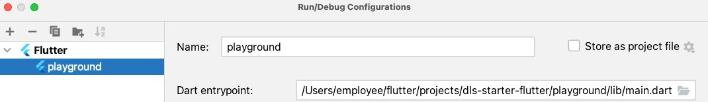

# Getting Started

## Using snapshot versions

We recommend only using latest version defined in the repository [tags] for stability & 
latest features. In order to use snapshot version use the following in your `pubspec.yaml`.

```YAML
dependencies:
  #...
  dls_thoughtworks:
    git:
      url: git@github.com:obvious/dls-starter-flutter.git
      ref: <latest-version>-SNAPSHOT #eg; v1.2.0-SNAPSHOT
```
## Playgroup App

Playground app provides a quick and easy way to explore components offered by DLS. You can configure
the components under different scenarios and see how they function.

To run the Playground app, run the Android Studio Emulator

- Create a Flutter run configuration in Android Studio. Define `playground/lib/main.dart` as
  `Dart entrypoint`, and press run button.
- 

Or 

- Run the following Flutter commands.

```shell
flutter pub get playground
flutter run -a playground/lib/main.dart
```

## Useful Links

- [Changelog](../CHANGELOG.md)
- [Contributing](CONTRIBUTING.md)
- [Readme](../README.md)

[//]: # (TODO: Update the link to your github respository tags)
[tags]: https://github.com/obvious/dls-starter-flutter/tags
